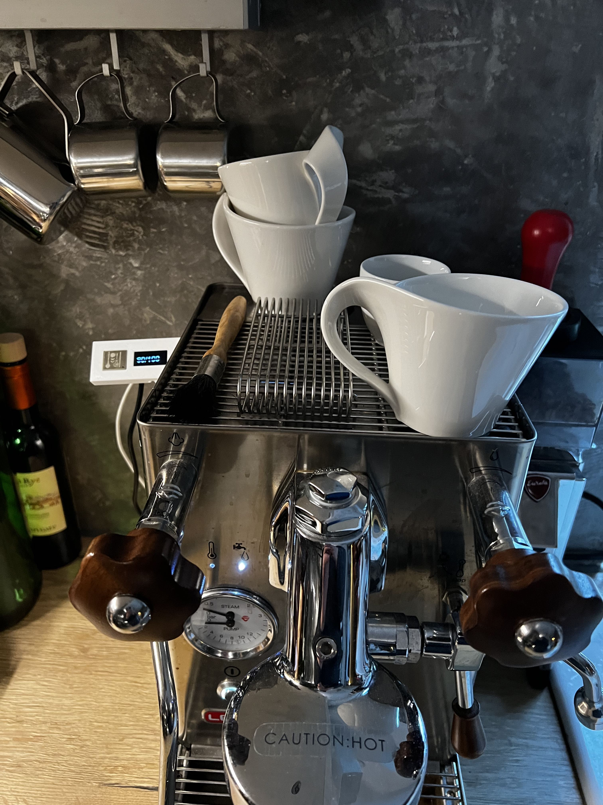
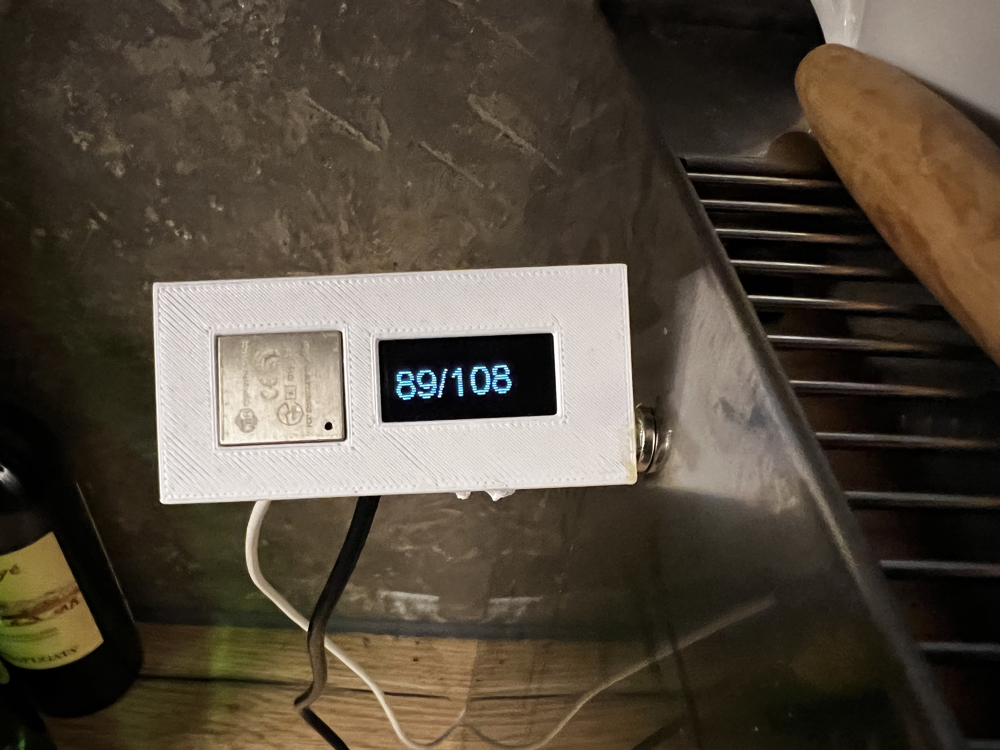
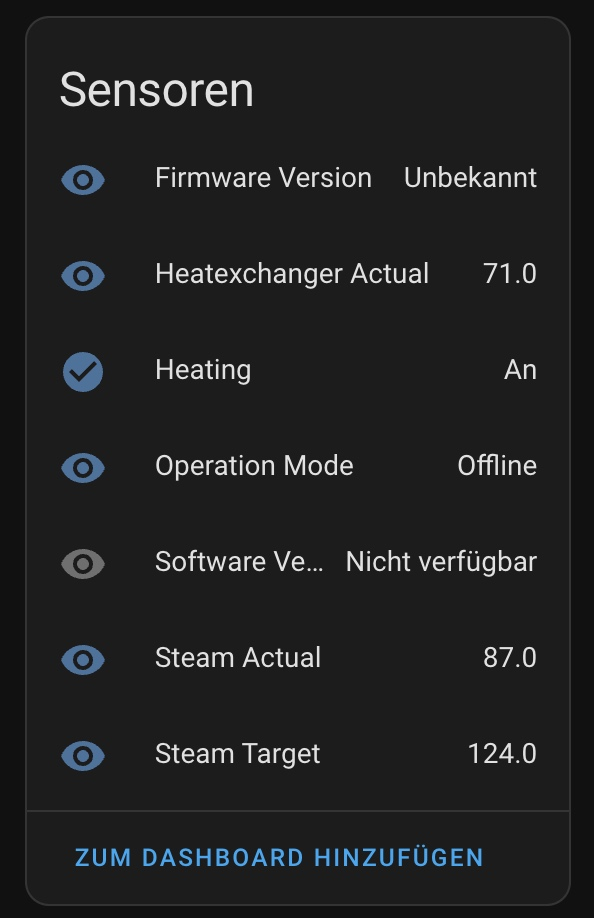
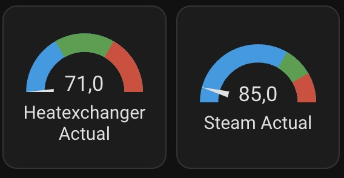

# Home Assistant Integration for Lelit MaraX with ESPHome

I build an integration for my Lelit MaraX Espresso Machine for Home Assistant.

This integration is based on this great [Reddit article](https://www.reddit.com/r/espresso/comments/hft5zv/data_visualisation_lelit_marax_mod)

I used an [Wemos Lolin32](https://randomnerdtutorials.com/esp32-built-in-oled-ssd1306) to connect with the PID of the MaraX. The connection is done via UART.

The coffee machine sends the following data about 4 times a second:

C123b,095,112,063,1095,1

First Character: C or S for Coffee-/Steam-Priority. Followed by the current firmware version.
Second value: Actual steam temperature
Third value: Target steam temperature
Fourth value: Actual Heatexchanger temperature
Fifth value: Remaining timer for fast heating
Sixth value: Heating on/off

When data is received it is shown on the display (Actual temperature of heat exchanger and steam) and sent to Home Assistant.

If no data is received for 5s the current time is shown instead.

In Home Assistant the data can be used to build dashboards.

Case: https://www.thingiverse.com/thing:3579080

